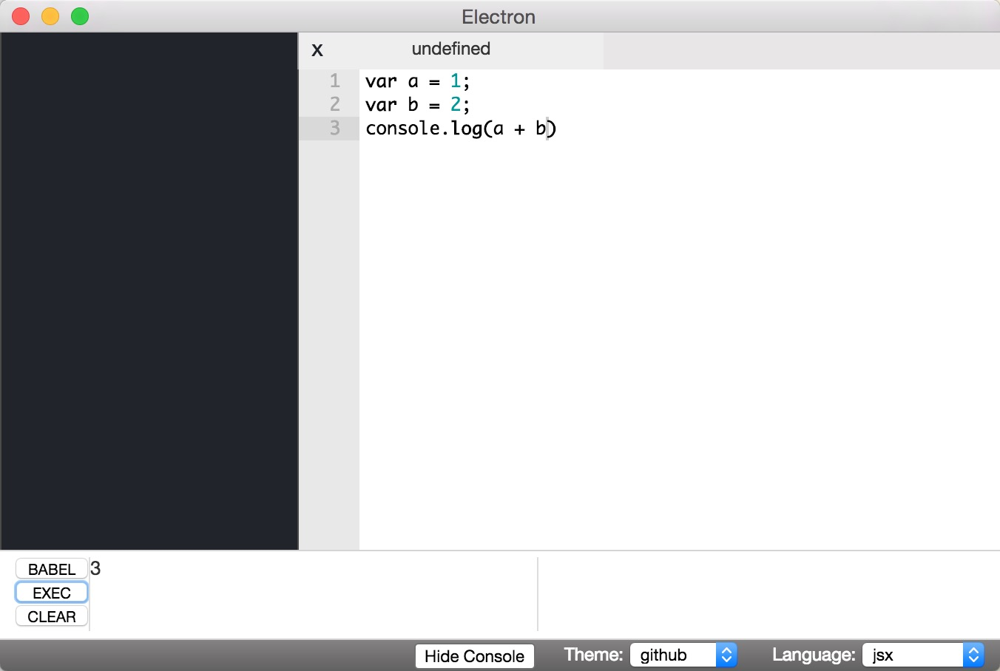
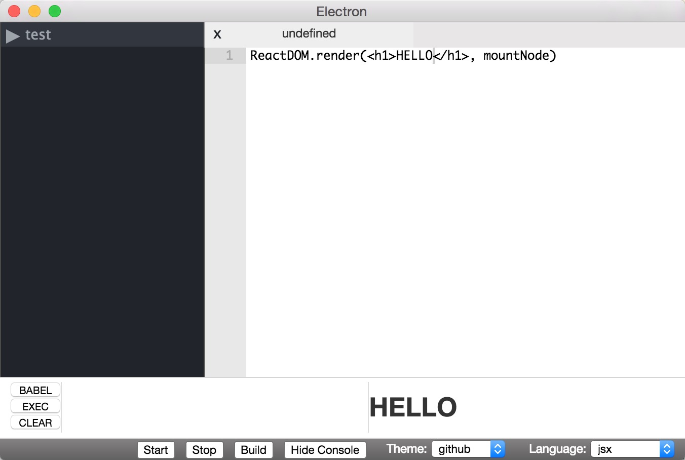
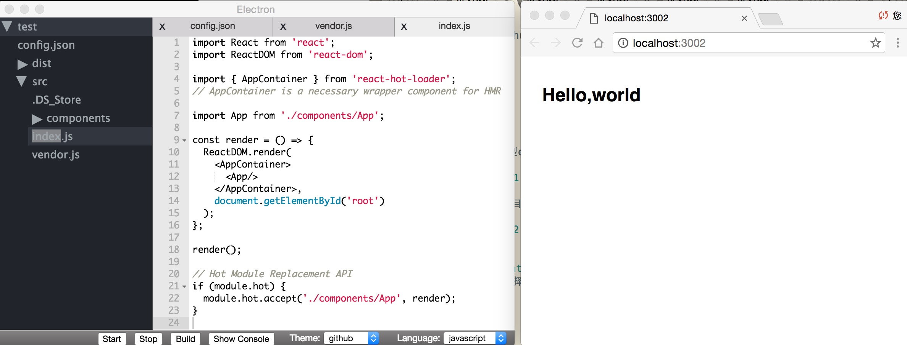
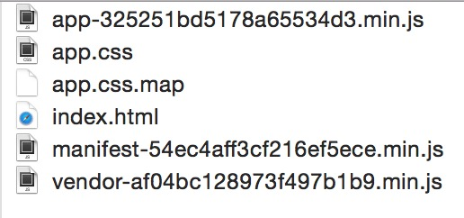

# react editor
这是一个简单的 react 编辑器, 基于electron开发。


## Getting started

```bash
git clone git@github.com:Jirapo/React-editor.git
cd React-editor
npm install
npm start
npm run server
```

## Features

### repl

 单页repl, 含有小型console。用户在编辑器里输入代码, 可以编译运行es6和一小段react代码, 显示运行结果。 
 左侧框显示常规运行结果，右侧框显示react代码结果。





#### 步骤

	1. 点击 'Show Console' 按钮
	2. 点击 'BABEL' 控制台显示babel编译后的代码
	3. 点击 'EXEC' 执行babel编译后的代码
	4. 点击 'CLEAR' 清空console

### react IDE

 导入react项目，不需要用户配置复杂的webpack.config.js, 这个编辑器会使用默认的webpack.config配置。
 同时编辑器可以运行和打包react项目。



####  步骤

	1. 请用户把 `./static/template/test` 复制到其它文件夹中
	2. 在编辑器菜单中选择 `File - Add React Project`， 导入刚才的复制出去的文件夹test
	3. 点击 'start' 按钮， 在浏览器中输入 `http://localhost:3001/` (端口号为 `config.json` 中的 `port` 字段值)
	4. 点击 'Stop' 按钮，编辑器停止该端口的监听，并停止该项目
	5. 点击 'Build' 按钮，编辑器将会打包该项目，打包目录为 `config.json` 中的 `output` 字段值

#### config.json

```javascript

{
	"port": 3002,               // listening port
	"entry": "src/index.js",    // entry file 
	"vendor": "src/vendor.js",  // vendor file 
	"output":"dist"             // output folder 
}

```

#### 打包目录文件




## Bugs

- 打开文件夹之后，如果在此目录新建文件，左侧文件树不会改变，需要重新打开文件夹，新的文件才会出现在文件树里。

- 在编辑器外如果对打开的文件进行修改，编辑器里面显示的文件不会有变化。

- 点击 'start', 'stop', 'build' 按钮，页面没有任何反馈。

－ 很多错误判断还没有写。

－ 样式使用postcss, 不支持less和sass。

－ ...
